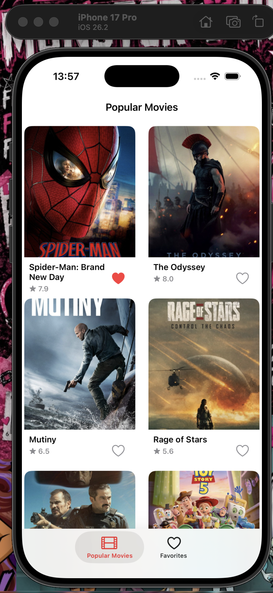
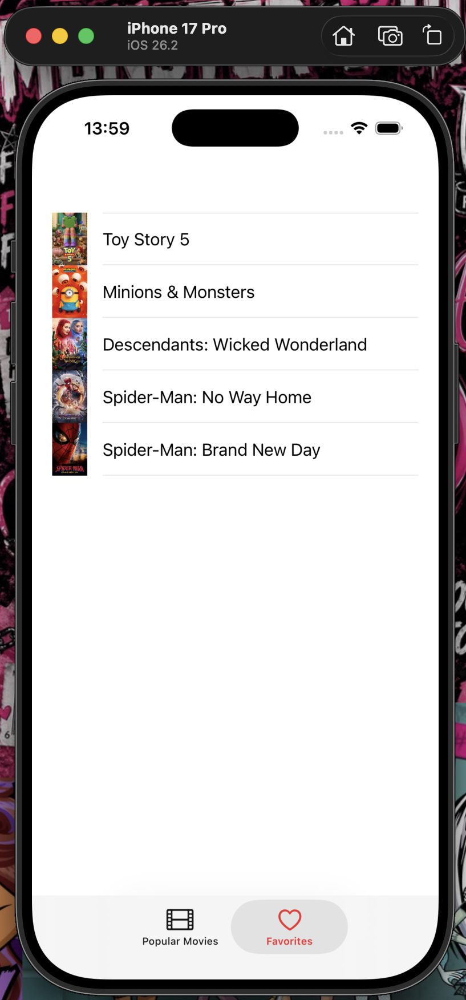
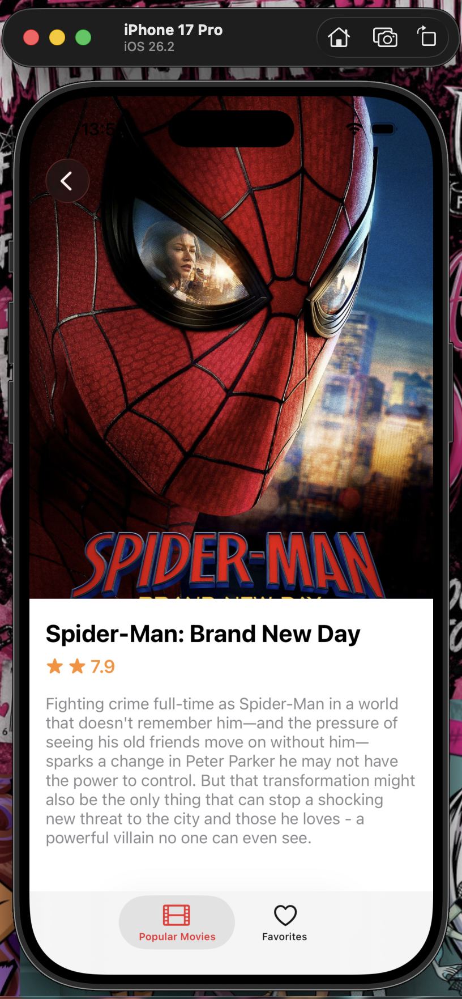
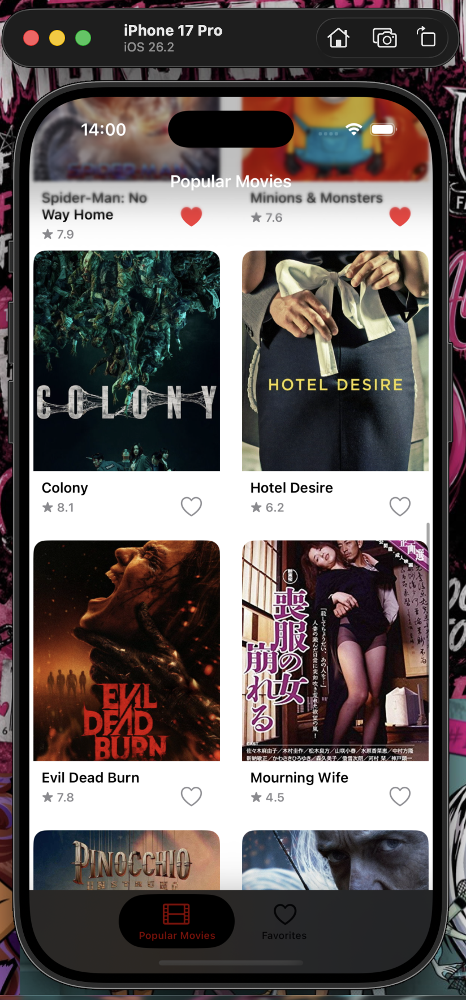

#  MovieeApp

A dynamic and modern iOS movie discovery application built using Swift, UIKit, and MVVM architecture. Allows users to explore trending movies, search titles, view detailed cast information, and save their favorite content to a watchlist.

---

##  Screenshots

| Disc| Favorites / Watchlist | Movie Detail ||
|:--------:|:---------------------:|:------------:|:-----------:|
|  |  |  |  |

---

##  Features

* **Clean Architecture:** Built using the MVVM design pattern for scalable and maintainable code structure.
* **Programmatic UI:** Designed fully programmatically without Storyboards using SnapKit.
* **Dynamic Movie Data:** Fetches real-time movie, cast, and review data via TMDB REST API.
* **Asynchronous Image Caching:** High-performance poster and avatar rendering using Kingfisher / SDWebImage.
* **Local Persistence:** Save favorite movies locally using Core Data / UserDefaults for quick access.

---

##  Tech Stack & Architecture

* **Language:** Swift
* **UI Framework:** UIKit (100% Programmatic UI / Auto Layout)
* **Architecture:** MVVM (Model-View-ViewModel)
* **Third-Party Libraries & Tools:**
  * **SnapKit:** Programmatic Auto Layout management
  * **Alamofire / URLSession:** Network layer and REST API integration
  * **Kingfisher / SDWebImage:** Image downloading and caching
  * **Core Data / UserDefaults:** Local storage and data persistence

---

##  Installation & Setup

1. **Clone the repository:**
   ```bash
   git clone [https://github.com/MelikeS28/MovieeApp.git](https://github.com/MelikeS28/MovieeApp.git)
